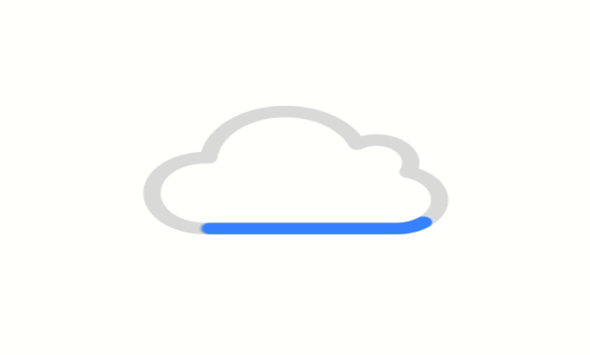
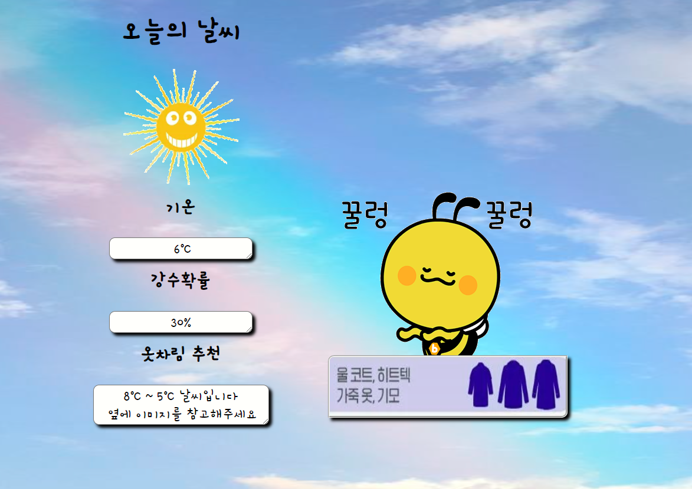

주제 : Open API 활용 웹 서비스

# ☀️ 오늘의 날씨를 통해 적절한 옷차림 추천 사이트 ⛈️
  

# 1.프로젝트 및 팀(팀원) 소개 👨‍💻 
### 👨‍🔧김주찬
### 👨‍💼박재현
### 👨‍🎨박지호
### 👨‍🔬천지민

## api 후보 🤷‍♂️
- 공공데이터 기상청 api
- 카카오맵 api
- 서울시 api
- 대중교통

---

# 2. 협업 방식 🧑‍🤝‍🧑
- 주제 선정 및 요구 사항 정리
- 기본 환경설정 통일
- 기본 HTML파일 생성 후 기능 구현
- 이후 CSS, 기능 분업하여 개발

---
  
# 3. 기능 시연 ⚒️
요구사항
- 날씨 api를 받아와 원하는 카테고리 사용하기
- 실행 시킨 기준의 날짜와 시간 반영
- 기온, 강수확률, 기온에 따른 옷차림 추천하기
- css, js 활용 하여 문서 꾸미기
  
---

# 4. 도메인 용어 정의 👨‍🏫
| 도메인 | 설명 |
| --------- | --------------------------------------------------------------- |
| textarea |  temperature: 온도,<br /> rainPercent: 강수확률,<br /> recommendCloth: 옷추천 문구 |
| chooseCloth() | 옷차림 추천해주는 부분,<br />tem = 1시간 기온 데이터 |
| setSkyStatus() | skyValue - 하늘상태 수치 , 하늘 상태에 따른 상단 이미지 변경 |
| weatherText() getWeatherData | 날씨 공공 데이터를 가져와 전반적인 기능을 구현하는 코드 부분 |

---
 
# 5. 핵심 기능 설명 및 구현 방법 👨‍🏫

## 🌦️ 오늘의 날씨 데이터 구현
### - 기상청 API 요청해서 가져온 데이터로 오늘의 날씨가 구현되는 부분입니다.

```javasript
const getWeatherData = () =>{
    
        const url = '/weather';
        const options = {
            method: 'GET',
            headers: {
                'Content-Type': 'application/json'
            },
            
        };
    
         fetch(url, options) //보내고
            .then(response => response.json()) //받는다.
            .then(data => {
                console.log(data);
                
                temperature.textContent = ` ${data.info["1시간 기온"]}℃`;
                rainPercent.textContent = `${data.info["강수확률"]}%`;

                chooseCloth(+data.info["1시간 기온"]);
                setSkyStatus(+data.info["하늘 상태"]);
                load.style.display = "none";

            })
            .catch(error => console.error(error));
    
}
```

## 📑 기상청 API 데이터 정제
### - 기상청 API 데이터를 받아올시 배열마다 카테고리별로 항목이 구분 되어 있습니다. 그래서 배열을 순회하여 데이터를 추출 한뒤, 프로젝트에서 사용하기 편하게 데이터를 정제했습니다.

```javasript
request.get(options, (error, response, body) => {
    if (!error && response.statusCode === 200) {
      const weatherData = JSON.parse(body).response.body.items;
      //   console.log(weatherData);

      const infoObj = {};
      weatherData.item.forEach((v) => {
        switch (v.category) {
          case 'POP':
            infoObj['강수확률'] = v.fcstValue;
            break;
          case 'PTY':
            infoObj['강수형태'] = v.fcstValue;
            break;
          case 'PCP':
            infoObj['1시간 강수량'] = v.fcstValue;
            break;
          case 'REH':
            infoObj['습도'] = v.fcstValue;
            break;
          case 'SNO':
            infoObj['1시간 신적설'] = v.fcstValue;
            break;
          case 'SKY':
            infoObj['하늘 상태'] = v.fcstValue;
            break;
          case 'TMP':
            infoObj['1시간 기온'] = v.fcstValue;
            break;
          case 'TMN':
            infoObj['일 최저 기온'] = v.fcstValue;
            break;
          case 'UUU':
            infoObj['풍속(동서성문)'] = v.fcstValue;
            break;
          case 'VVV':
            infoObj['풍속(남북성분)'] = v.fcstValue;
            break;
          case 'WAV':
            infoObj['파고'] = v.fcstValue;
            break;
          case 'VEC':
            infoObj['풍향'] = v.fcstValue;
            break;
          case 'WSD':
            infoObj['풍속'] = v.fcstValue;
            break;
          default:
            break;
        }
      });
```

## 👕 옷차림추천
### - 요청을 통해 받아온 데이터에서 1시간 기온 수치를 기반으로 온도에 따라 옷을 추천하도록 조건식을 설정했습니다.

```javasript
const chooseCloth = (tem)=>{ //옷차림 추천 코드, tem = 1시간 기온 데이터
        if(tem>=28){
            recommendCloth.textContent = resultCloth[0];
            cloth.src = "./image/28도이상.PNG";
        }
        else if(tem<28 && tem>=23){
            recommendCloth.textContent = resultCloth[1];
            cloth.src = "./image/27이하.PNG";
        }
        else if(tem<23 && tem>=20){
            recommendCloth.textContent = resultCloth[2];
            cloth.src = "./image/22이하.PNG";
        }
        else if(tem<20 && tem>=17){
            recommendCloth.textContent = resultCloth[3];
            cloth.src = "./image/19이하.PNG";
        }
    
        else if(tem<17 && tem>=12){
            recommendCloth.textContent = resultCloth[4];
            cloth.src = "./image/16이하.PNG";
        }
    
        else if(tem<12 && tem>=9){
            recommendCloth.textContent = resultCloth[5];
            cloth.src = "./image/11이하.PNG";
        }
    
        else if(tem<9 && tem>=5){
            recommendCloth.textContent = resultCloth[6];
            cloth.src = "./image/8이하.PNG";
        }
    
        else if(tem<5){
            recommendCloth.textContent = resultCloth[7];
            cloth.src = "./image/4이하.PNG";
        }
    
        else
        console.log('error');
        
    }
```

## ⛈️ 날씨 상황에 따라 날씨 이미지 변경
### - 날씨 상태에 따라 조건식으로 이미지를 변경할 수 있도록 했습니다. 0-5는 맑음 6-8은 구름많음 9-10은 흐림으로 분류된다는 기상청의 조건을 반영하여 제작했습니다.

  ```javasript
   const setSkyStatus = (skyValue) => { //skyValue - 하늘상태 수치 , 하늘 상태에 따른 상단 이미지 변경
        if(skyValue>=0 && skyValue<=5){
            //맑음 이미지로 표시하는 코드
            sky.src = "https://cdn.pixabay.com/animation/2022/07/28/11/53/11-53-26-148_512.gif"; //상황에 맞는 이미지 넣으면 가능
            background.src = "https://i.pinimg.com/564x/9f/58/05/9f58054025a9d219b71c6daa297368b5.jpg";
            
        }
        else if(skyValue>5 && skyValue<=8){
            //구름 많음 이미지로 표시하는 코드
            sky.src = "https://i.pinimg.com/564x/16/8a/6a/168a6a352753f0f389f01d6ac0d3995e.jpg";
            background.src = "https://i.pinimg.com/474x/12/40/d2/1240d26d134ac829f9461faf32968c79.jpg";
            
        }
        else if(skyValue>8 && skyValue<=10){
            //흐림 이미지로 표시하는 코드
            sky.src = "https://cdn.pixabay.com/animation/2023/11/11/18/15/18-15-55-407_512.gif"; //상황에 맞는 이미지 넣으면 가능
            background.src = "https://i.pinimg.com/564x/8c/6a/d9/8c6ad9f256b1093f071849bb2627ba9a.jpg";
        }
    }
  ```

## ⏰ 로딩 화면 구성
### - API요청 시간이 조금 걸리는데, 이 시간 동안 로딩 화면이 나오도록 구성했습니다. 데이터를 불러오게 되면 display=none으로 로딩화면을 숨김했습니다.

## ☑️ ESLint 사용
### - airbnb 에 맞춰 ESLint 를 기본 설정하였고 저희가 개발에 필요하다고 판단된 룰셋은 off 시켜서 개발했습니다.

---

# 6. 트러블 슈팅 👏
### 1. 날씨 데이터를 받아올떄 문자열로 방대한 데이터를 받아서 처리하기 곤란하였습니다.<br />
 - 이를 데이터로 분리하기위하여 JSON.parse를 하여 데이터화 시키고 필요한 데이터를 얻기위해 한단계 한단계씩 들어가 데이터화 했습니다.
   
  
### 2. 데이터 중 필요한 값만 갖고 온 data.info를 갖고와 사용할 때에, 1시간 기온값이 string타입으로 되어 있어서 조건문을 통해 기온 값을 확인할때 문제가 발생했습니다.<br />
 - 해당 문제는 받아온 data를 number 타입으로 전환 시키기 위해 함수안에 들어가는 매개변수 앞에 **+**를 입력해 number 타입으로 인식 시켰습니다.

  
### 3. 날씨 상태에 따른 이미지 변경 과정에서 이미지의 주소값을 변경하였지만 변경이 안 되는 문제 발생했습니다.<br />
 - 문제는 변경하는 부분에서 img의 innerText를 사용한 것이 문제가 되었음을 인지 후, src에 주소를 그대로 입력함으로써 문제를 해결했습니다.

  
### 4. ESLint 규칙이 비정상적으로 동작하는 것을 인지를 늦게하여 뒤늦게 ESLint 활성화를 시켰고 그에 따라 기존에 작성한 코드들이 에러가 많이 발생했습니다.<br />
 - 각 에러부분에 대한 해결을 ESLint의 문서를 참고하고 필요한 부분만 규칙을 설정했습니다. 필요없는 것은 off 처리함으로써 정상적으로 작동시켰습니다.
   
 ---  
  
# 7.  ESLint 규칙 및 적용 후기 🤙
-  no-console = console 사용을 허용하게 함 <br />
 -> off로 함으로서 개발 중간에 확인 가능
-  no-undef = 선언 되지 않는 변수 사용을 허용하지 않음 <br />
 -> window의 documet에 접근 하지 못해서 off로 설정
- prefer-destructuring = 배열 파괴를 허용하지 않음 <br />
 -> array[index] , obj[key]로 접근한 값을 변수에 할당 , textContent 에 바로 값을 주기 위해 off로 설정

---
  
# 8. 회고(느낀점) - 팀원 전부 각자 느낀점 😂
- 김주찬 - git 협업 할때 브랜치 따로 안따고 하나에 main 브랜치 에서 개발을 하였는데 pull 할때마다 git stash 라는 명령어를 사용해서 작업 하던 파일을
잠시 다른 영역에 저장하여 충돌 에러 문제가 많이 발생하지 않아 좋은 명령어를 알게 되었습니다.
- 박재현 - Naver API가 사용하기 좋았어서 다른 OpenAPI를 쓰는것에 있어 약간의 두려움이 있었지만 이 프로젝트를 통해 다른 OpenAPI도 사용할수 있게
되어 좋은 경험이었던것 같습니다. 그리고 팀원들과 같이 의견을 맞춰 나가면서 재밌었습니다.
- 박지호 - 내가 아직 git을 사용할 줄 아는건지 확신하지 못하겠다.(= 아직 모르는거 맞다) 그래도 git에 대한 이해도가 점차 상승하고 있습니다.
프로젝트를 하면서 아직 미약했던 서버구축과 API 요청 등이 정리되고 이해되는 시간이었습니다. 또한 CSS JS를 하면서 이전에 했던 공부를 복습하는 시간이었습니다.
- 천지민 - 외부 일정 때문에 주제 선정에만 참여하였는데 이를 통해 다양한 API에 대해 알아볼 수 있어서 좋았고 수업 때 완전히 이해하지 못한 만큼 따로 공부해야겠다고 생각하게 되었습니다


